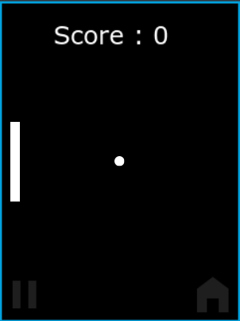
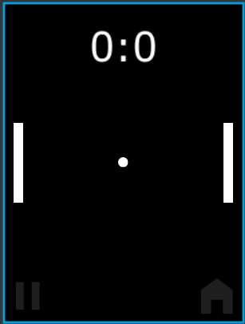
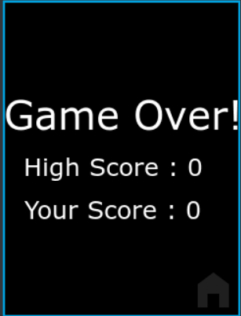
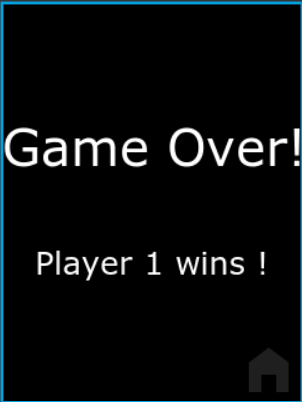
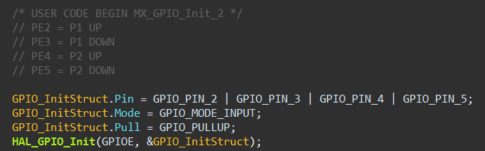
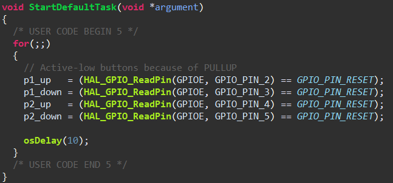

# 🎮 Ping Pong Game on STM32 (TouchGFX)

## 📌 Project Overview
This project is a **Ping Pong game** implemented on an **STM32F429ZIT6 Discovery board** using **STM32CubeIDE** and **TouchGFX**.  
The game supports **single-player and multiplayer modes**, real-time paddle control using physical buttons, ball collision physics, scoring logic and a game-over screen highlighting the winner.

This repository contains:
- Full source code
- Project report

---

## 🧠 Project Objectives
- Design a simple embedded game using STM32 and TouchGFX
- Implement real-time input handling using GPIO buttons
- Apply collision detection and physics logic

---

## 🛠️ Hardware Components
- **STM32F429ZIT6 Discovery Board**
- **LCD Display** (on-board)
- **Push Buttons** (GPIO input, active-low with pull-up)

---

## 💻 Software & Tools
- **STM32CubeIDE**
- **TouchGFX Designer**
- **HAL Drivers**
- **C / C++**
- **ARM GCC Toolchain**

---

## 🧩 System Architecture
The project follows the **TouchGFX MVP (Model–View–Presenter)** pattern:

- **Model**
  - Stores shared game data (scores, winner)
- **View**
  - Handles UI rendering, animations, and user interaction
- **Presenter**
  - Acts as a bridge between View and Model

This structure improves maintainability and readability of the code.

---

## 🎮 Game Features

### 🔹 Game Modes
<<<<<<< HEAD
- **Singleplayer Mode**
  - Player 1
  - Physical buttons control paddles
  - Counts highest number of bounces
  - Shows current score and high score after game over

  
 
 <i>Figure 2: Singleplayer screen designed in TouchGFX</i> 

=======
>>>>>>> bf589f7662778433bc0cfd6e298ed364f5d37041
- **Multiplayer Mode**
  - Player 1 vs Player 2
  - Physical buttons control paddles
  - Configurable win conditions (e.g. first to 3, 7, or 15 points)
<<<<<<< HEAD
  - Shows winner after game over

  
 
 <i>Figure 2: Multiplayer screen designed in TouchGFX</i> 

=======
>>>>>>> bf589f7662778433bc0cfd6e298ed364f5d37041

### 🔹 Gameplay Logic
- Ball movement with X/Y velocity
- Collision detection with paddles and screen edges
- Angle-based bounce depending on paddle hit position
- Speed clamping to avoid unrealistic movement

### 🔹 Scoring System
<<<<<<< HEAD
- **Singleplayer Mode**
    - Points awarded when player hits the ball (Singleplayer)
    - Game ends when the ball hits the ground
    - Automatic transition to **GameOver screen**
- **Multiplayer Mode**
    - Points awarded when opponent misses the ball (Multiplayer)
    - Game ends when a player reaches the target score
    - Automatic transition to **GameOver screen**
=======
- Points awarded when opponent misses the ball
- Game ends when a player reaches the target score
- Automatic transition to **GameOver screen**
>>>>>>> bf589f7662778433bc0cfd6e298ed364f5d37041

### 🔹 Game Over Screen
- Displays winner using formatted text:

<<<<<<< HEAD
- Player score and high score is passed through the Model (Singleplayer)

  
 
 <i>Figure 3: Game Over screen highlighting player score and highest score</i> 

- Winner information is passed through the Model (Multiplayer)

  
 
 <i>Figure 3: Game Over (Multiplayer) screen highlighting the winning player</i> 

=======
- Winner information is passed through the Model

>>>>>>> bf589f7662778433bc0cfd6e298ed364f5d37041
---

## 🔘 Input Handling
- Buttons are configured as **active-low inputs**
- Internal pull-up resistors are used
- Button states are read via HAL GPIO functions
- Inputs are shared between application logic and TouchGFX using `extern` variables

<<<<<<< HEAD

  
 
 <i>Figure 4: GPIO configuration for paddle control</i> 

  
 
 <i>Figure 4: GPIO reading for paddle control</i> 

=======
>>>>>>> bf589f7662778433bc0cfd6e298ed364f5d37041
---

## ✅ Conclusion
This project demonstrates the development of a simple embedded graphical application using STM32CubeIDE and TouchGFX.  
It integrates hardware input, real-time graphics, game logic, and structured software design using the MVP pattern.

---

## 👤 Author
**Nguyen Lam**  
Final Project – Embedded Systems

